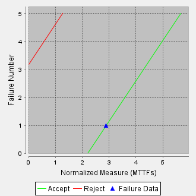

**SENG 438- Software Testing, Reliability, and Quality**

**Lab. Report \#5 – Software Reliability Assessment**

| Group \#:   2    |   |
|-----------------|---|
| Student Names:  |   |
| Robert Hauta    |   |
| Joshua Weir     |   |
| Ernest Sarna    |   |
| Jana Afifi      |   |

# Introduction

This lab focuses on using reliability assessment tools, specifically in the contexts of Reliability Growth Testing (RGT) and Reliability Demonstration Charts (RDC). We will use software tools such as C-SFRAT and SRTAT to model these assessment methods and analyize the data of the provided sample datasets.

The goal of this lab is to understand the usability and features of both assessment methods, including the use of specific metrics such as target failure rate or MTTF criteria. To further understand these assessment tools, we will also discuss the advantages and disadvantages of both.

# Assessment Using Reliability Growth Testing 

For the Reliability Growth Testing (RGT) portion in this lab, our group used the Covariate Software Failure and Reliability Assessment Tool (C-SFRAT). The data used in this portion was the provided DATASET1 under the Failure Count datasets.

C-SFRAT provides built-in Model Comparison functionality. The built-in tool uses common statistical goodness-of-fit metrics to compare each model, and find which best demonstrates the input data. THe tool rates each model from 0 to 1, with the best-fit models ranging closer to 1. Shown below are the goodness-of-fit scores for four models: IFR Generalized Salvia & Bollinger, Discrete Weibell (Type III), Negative Binomial (Order 2), and Truncated Logistic.

 

The Critic (Mean) column shows that the Negative Binomial (Order 2) and Truncated Logistic models are the best-fit.

Regarding the range of the data, we used the Laplace test to select the useful range of data. The Laplace test determines if there is an upward trend in a dataset. When testing the reliabitility of system, this test can be used to validate successive failures in a system. Our data fit an exponential (thus, desirable model) for a 42-point data subset.

Below is a plot of failures/time interval with the predictive model included in the plot.

 

Below is a failure intensity plot of the dataset.

 

The tools and plots discussed above are crucial in decision-making when given a target failure rate. This information can be leveraged to optimize tracking bugs in pre-release, as well as collecting data to guide the software testing process and maintaining the product after release.

# Assessment Using Reliability Demonstration Chart 
<strong>MTTFmin Plots:</strong> 
MTTFmin:  
 

MTTFmin / 2:  
 

MTTFmin * 2:  
 

<strong>Choice For MTTFmin:</strong> 
We chose the MTTFmin value based on the boundary between the continue and accept regions. To find the minimum acceptable MTTF for the tests to pass we chose the MTTF value that sits right on the aforementioned boundary. In this case the value we chose for MTTFmin was about 2.88 when using the default values for Discrimination Ratio(𝞬), Customer Risk(β), and Developer Risk(ɑ) which were 2, 0.1, 0.1, respectively, we also set the failures per second to 1.44. We decided to choose MTTFmin to be on the continue/accept boundary because a value below the boundary would necessitate the continuation of testing and not its acceptance. Meanwhile a value above the boundary would still constitute acceptance however it would not be the smallest value to do so.

<strong>Advantages and Disadvantages:</strong> 
RDC is a great certification testing tool that is a very versatile, time- and cost-efficient way to analyze the reliability of a system. Using the RDC we can easily experiment with different confidence levels as well as MTTF values which allows us to gain a better understanding of how the chart changes when provided with different values. A disadvantage of using RDC to assess the reliability of tests is that RDC does not provide exact values for the reliability or availability of the system being tested, the RDC only indicates whether a test set is acceptable or not which may not be enough in case more detailed results are necessary.

# 

# Comparison of Results
As can be seen from our Reliability Growth Testing, the data becomes no longer acceptable at around interval 42, this is the approximate location of the inflection point of the graph which determines where the data should be cut off for analysis. When looking at the RDC we see that the minimum MTTF is at around 1.44 failures per second, which is when the tests become acceptable. When looking at the intensity graph from the Growth Testing we can average the number of failures per interval to about 1.07 which is below the minimum MTTF of 1.44, intervals in this case being seconds. When inputting this value into the RDC we see that the data is now in the continue region meaning that we will have to continue testing to see whether the tests have met the failure intensity objective or not. Using both of these techniques is crucial to determining whether a test set can be accepted or rejected based on various criteria as both techniques are needed to determine the end result.

# Discussion on Similarity and Differences of the Two Techniques

Reliability Demonstration Charts firstly give us information on whether enough testing has been done to the system under test to make any hard conclusions. Secondly, if enough testing has been done, the Reliabilty Demostration Chart will indicate if the system is accepted or rejected based on the MTTF. Additionally, the RDC takes in parameters based on customer and producer specifications to come up with the boundary lines between accept and continue regions as well as reject and continue regions. Similarly, Reliability Growth Testing can determine if sufficient testing has been done based on a best fit model of the failure intensity and a given value for the target failure rate. Although both techniques give information on if sufficient testing has been done, Reliability Growth Testing gives a prediction on how much more testing must be done. Another difference between the two techniques is the fact that RDC uses a normalized mean time to failure whereas Reliability Growth Testing uses data in the form of discrete time intervals and number of failures.

# How the team work/effort was divided and managed

For this lab, we collaboratively worked on our Reliability growth testing and Reliability assessment using Reliability Demonstration Chart (RDC). 
Jana and Robert both worked on Reliability growth testing while Ernest and Joshua worked on Reliability assessment using Reliability Demonstration Chart (RDC). 

We all participated in discussing and comparing the results of the charts.

# Difficulties encountered, challenges overcome, and lessons learned
The greatest challenge we faced as a group was figuring out how to use C-SFRAT and generate different graphs. We tackled this problem by trying different features until we figured out how it works. Another problem we faced is that some of us had troubles with C-SFRAT it kept freezing and crashing and sometimes it did not work properly. In addition, it is not compatible with mac laptops so some of the team members struggled with this issue that they could not use the program. 
# Comments/feedback on the lab itself
We found this lab very helpful as it allowed us to gain experience with assessing the reliability of a system. Also, we are now familiar with C-SFRAT and START and we know how to use them.
